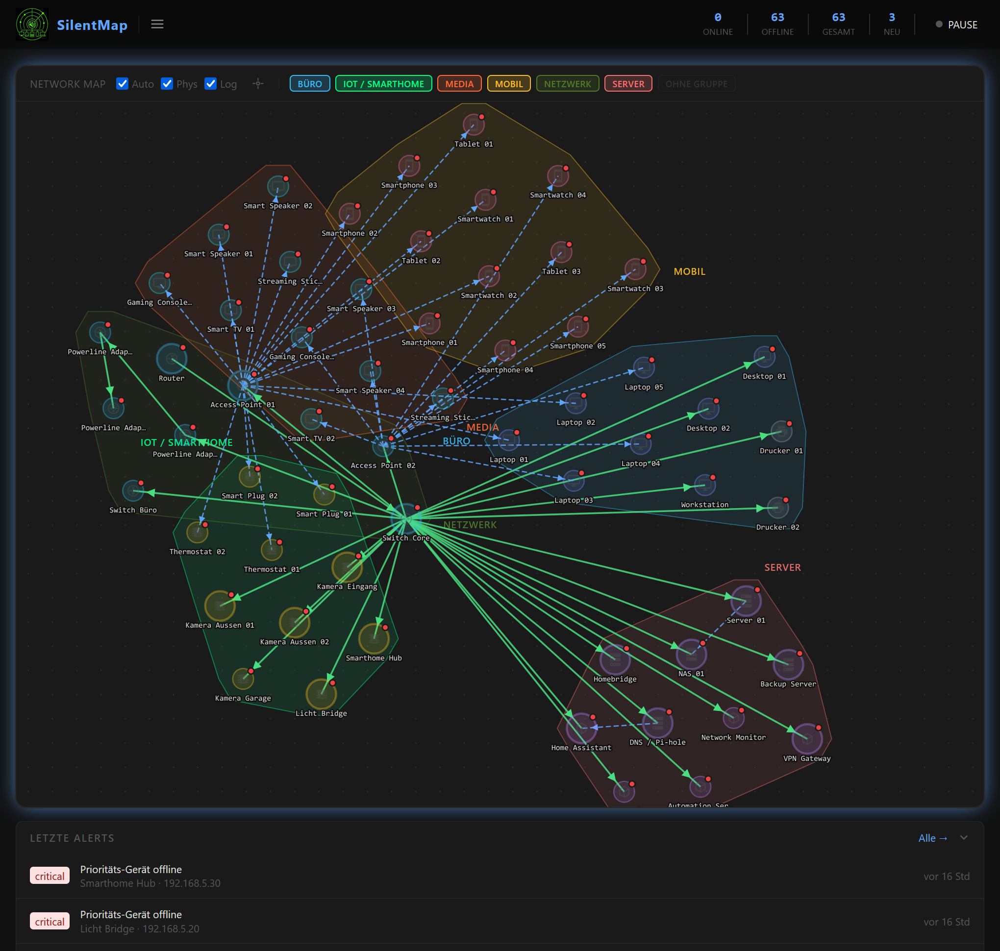
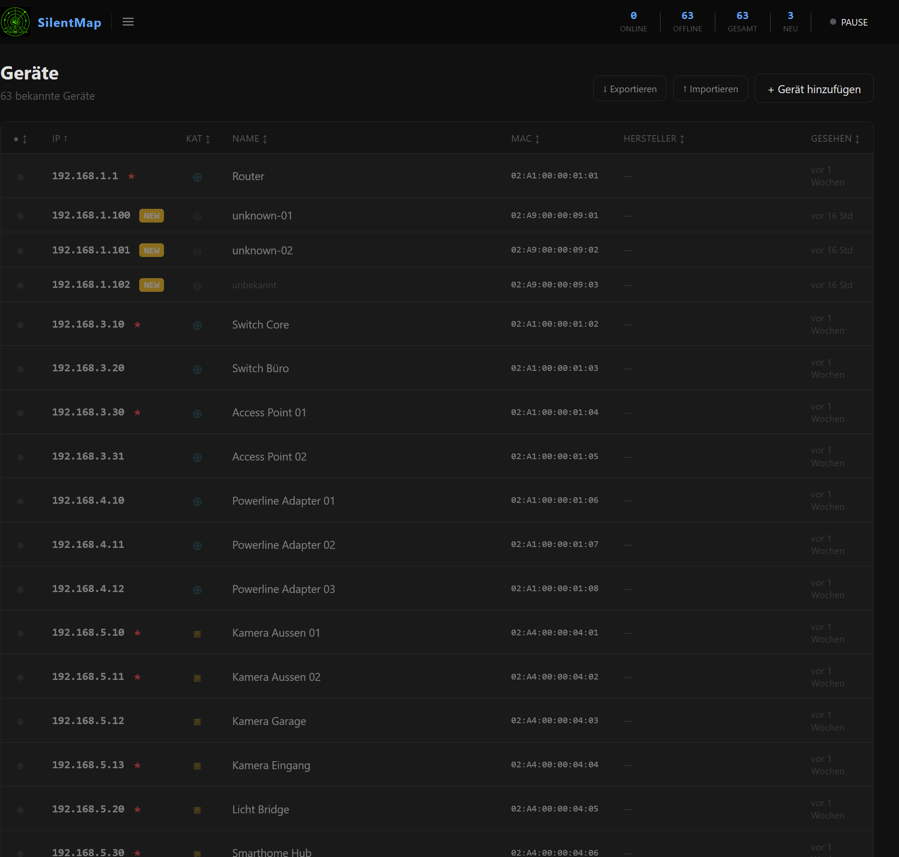
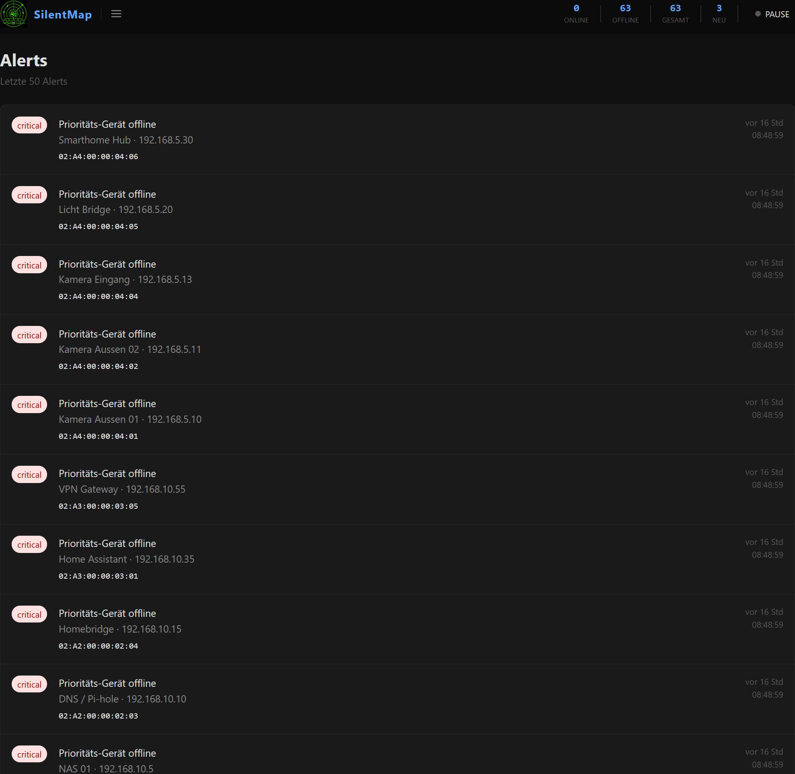
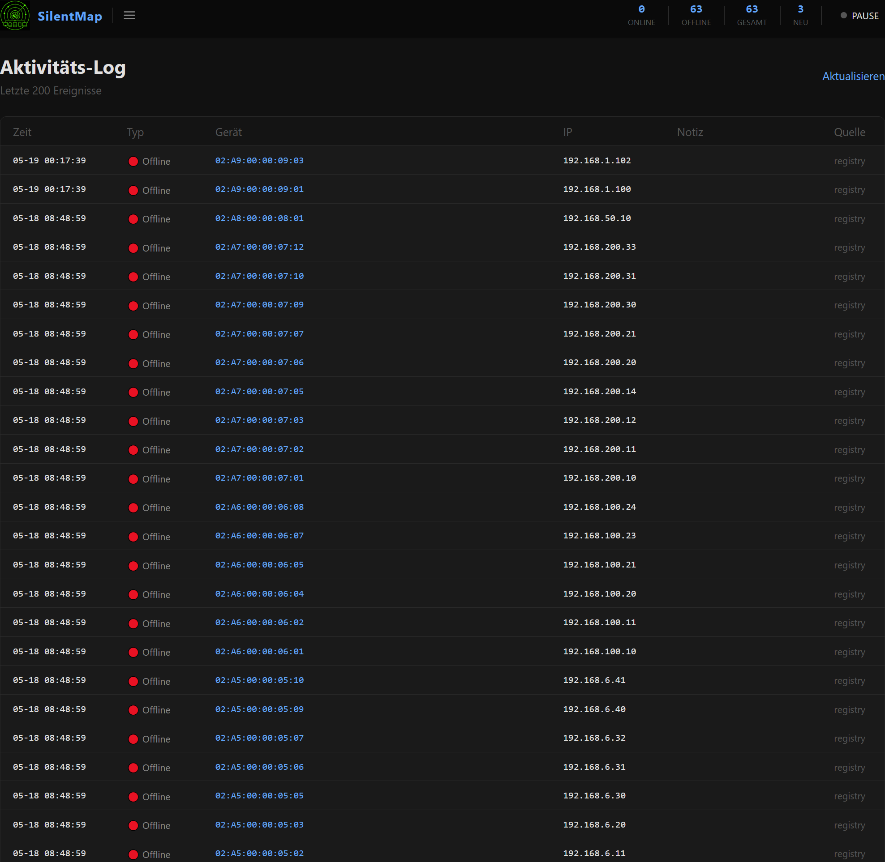
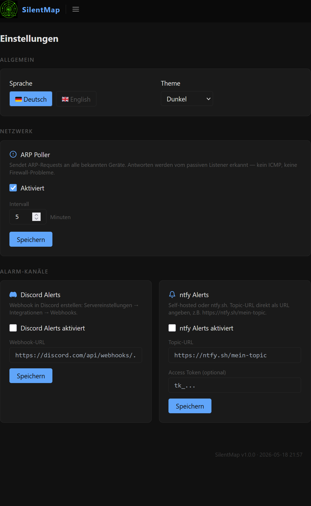

<p align="center">
  
</p>

# SilentMap

Passive discovery, minimal footprint — sees everything, disturbs almost nothing.

**GitHub:** [FischermanCH/silentmap](https://github.com/FischermanCH/silentmap)
**Docker Hub:** [fischermanch/silentmap](https://hub.docker.com/r/fischermanch/silentmap) — `docker pull fischermanch/silentmap:latest`
**Product:** [fischerman.ch/projects/silentmap](https://fischerman.ch/projects/silentmap/)

**Languages:** [English](#english) · [Deutsch](#deutsch)

---

<details open>
<summary><strong>Dashboard &amp; Topology Map</strong></summary>
<br>
<a href="internal/web/static/PS-SilentMap-Main.png">
  
</a>
</details>

<details>
<summary><strong>Devices · Alerts · Log · Settings</strong></summary>
<br>
<a href="internal/web/static/PS-SilentMap-Devices.png">
  
</a>
<a href="internal/web/static/PS-SilentMap-Alerts.png">
  
</a>
<br>
<a href="internal/web/static/PS-SilentMap-Log.png">
  
</a>
<a href="internal/web/static/PS-SilentMap-Config.png">
  
</a>
</details>

---

<a name="english"></a>
# English

## What SilentMap is

SilentMap discovers devices passively — it listens to the traffic your network already generates (ARP announcements, mDNS broadcasts, DHCP leases) and never probes unknown hosts. Once a device is known, it optionally sends lightweight ARP or ICMP requests to track online/offline state. When something unexpected appears, or a priority device drops off the network, it alerts you.

Passive discovery. No agent to install. Minimal wire footprint.

It is a single self-contained binary with an embedded SQLite database, an embedded web UI, and no external runtime dependencies. Docker or native Linux — your choice.

SilentMap was built as a lean, understandable alternative to tools like NetAlertX: fewer moving parts, a cleaner UI, and a codebase that a single person can read and extend.

The project was designed and built in collaboration with Claude (Anthropic) as a real-world example of human + AI software development.

---

## Who SilentMap is for

**Good fit:**
- Home lab and small office networks (up to a few hundred devices)
- Anyone who wants to know what is on their network without touching it
- Raspberry Pi, a small VM, or a Docker host on the LAN
- Self-hosters who value a clean UI and a maintainable codebase

**Not the current target:**
- Enterprise environments with VLANs and routed subnets (passive ARP only sees the local segment)
- Networks that require agent-based discovery or SNMP polling
- Users who need active scanning by default

---

## Current feature snapshot

| | |
|---|---|
| **Passive discovery** | New devices found from existing traffic — no probing of unknown hosts |
| **Zero-config** | Works out of the box with no configuration file required |
| **Multi-collector** | ARP · mDNS · DHCP · optional ICMP ping · on-demand nmap |
| **Vendor lookup** | OUI database embedded — MAC resolved to manufacturer |
| **Inventory** | MAC, IP, hostname, vendor, label, category, groups, topology map |
| **Priority devices** | Per-device flag — ICMP monitored even across subnets |
| **Alert engine** | New device · Priority offline · Device back online |
| **ntfy** | Push notifications via ntfy.sh or self-hosted instance |
| **Discord** | Webhook-based alerts |
| **Topology map** | Interactive D3.js network graph with parent/child and group view |
| **Export / Import** | Full JSON backup including groups, connections, labels |
| **Listening toggle** | Pause passive discovery with one click |
| **Themes** | Dark, light and custom themes — switchable at runtime |
| **Bilingual** | German and English UI — switchable at runtime |
| **Single binary** | No CGO, no external dependencies, embedded SQLite |
| **Docker** | Multi-stage build, non-root user, `cap_net_raw` only |
| **API** | REST endpoints for stats, topology, export, version, health |

---

## Architecture at a glance

```
LAN traffic (ARP / mDNS / DHCP)
        │
        ▼
  Collector modules  ──────────────────────────────────────────────┐
  (arp · mdns · dhcp · ping · nmap)                                │
        │                                                           │
        ▼                                                           ▼
   Event bus  ──────────►  Alert engine  ──────►  ntfy · Discord
        │                  (rules + cooldown)
        ▼
    Registry (SQLite)
        │
        ▼
    Web UI (chi · Go templates · D3.js)
```

Collectors publish events onto an in-process bus. The registry persists device state. The alert engine subscribes to the bus and routes fired alerts to channels. The web layer reads from the registry and serves the UI and REST API.

---

## Install — Docker (recommended)

```bash
docker run -d \
  --name silentmap \
  --network host \
  --cap-add NET_RAW \
  -v silentmap-data:/data \
  -e TZ=Europe/Zurich \
  fischermanch/silentmap:latest
```

Open **http://localhost:8080**

`--network host` is required so SilentMap can see ARP, mDNS and DHCP traffic on your LAN segment.
`--cap-add NET_RAW` grants packet-capture capability without running as root.

---

## Install — Docker Compose

Save as `docker-compose.yml` and run `docker compose up -d`:

```yaml
services:
  silentmap:
    image: fischermanch/silentmap:latest
    container_name: silentmap
    restart: unless-stopped
    network_mode: host
    cap_add:
      - NET_RAW
    volumes:
      - silentmap-data:/data
    environment:
      - TZ=Europe/Zurich
    healthcheck:
      test: ["CMD", "wget", "-qO-", "http://localhost:8080/health"]
      interval: 30s
      timeout: 5s
      retries: 3

volumes:
  silentmap-data:
```

**Update:**
```bash
docker compose pull && docker compose up -d
```

---

## Install — Native Linux

Requires Go 1.25+. Produces a single static binary with no external runtime dependencies.

```bash
git clone https://github.com/FischermanCH/silentmap
cd silentmap
go build -o silentmap ./cmd/silentmap

# Grant packet-capture capability (no root required after this)
sudo setcap cap_net_raw+eip ./silentmap

./silentmap --data ./data
```

Open **http://localhost:8080**

### systemd service

A ready-to-use service unit is included at [`silentmap.service`](silentmap.service).

```bash
sudo cp silentmap.service /etc/systemd/system/
# Edit User= and paths to match your setup
sudo systemctl daemon-reload
sudo systemctl enable --now silentmap
```

---

## Configuration

All settings are optional. Without a configuration file SilentMap works with sensible defaults.

Place `silentmap.yaml` in your data directory (e.g. `/data/silentmap.yaml` in Docker):

```yaml
interface: ""          # empty = auto-detect

web:
  listen: "0.0.0.0:8080"

collectors:
  arp:
    offline_timeout: 15m
  ping:
    enabled: true
    targets: "priority"   # only ICMP-ping devices marked as Priority
    interval: 5m

alerts:
  rules:
    new_device:
      enabled: true
      severity: "high"
    priority_offline:
      enabled: true
      severity: "critical"
      cooldown: 30m
    device_back:
      enabled: true
      severity: "info"
  channels:
    ntfy:
      enabled: true
      url: "https://ntfy.sh/your-topic"
    discord:
      enabled: false
      webhook_url: ""
  routing:
    critical: ["ntfy", "discord"]
    high:     ["ntfy"]
    info:     []
```

Full reference: [`configs/silentmap.example.yaml`](configs/silentmap.example.yaml)

---

## API

| Endpoint | Description |
|---|---|
| `GET /health` | Health check — `{"status":"ok"}` |
| `GET /api/stats` | Online/offline counts, listening state |
| `GET /api/version` | Version string and build time |
| `GET /api/topology` | Full network topology as JSON |
| `GET /api/alerts` | Recent alerts as JSON (pre-translated) |
| `GET /api/export` | Complete device export as JSON |
| `POST /api/import` | Import devices from a JSON export |

---

## Documentation

- [`HELP.md`](HELP.md) — full setup guide, alert configuration, FAQ
- [`configs/silentmap.example.yaml`](configs/silentmap.example.yaml) — annotated configuration reference
- [`CHANGELOG.md`](CHANGELOG.md) — version history
- [`docs/`](docs/) — architecture, module descriptions, deployment guides

---

## License

MIT — see [LICENSE](LICENSE)

---

<a name="deutsch"></a>
# Deutsch

## Was SilentMap ist

SilentMap erkennt Geräte passiv — es lauscht auf Traffic der im Netzwerk ohnehin entsteht (ARP-Announcements, mDNS-Broadcasts, DHCP-Leases) und sendet nie Probes an unbekannte Hosts. Ist ein Gerät einmal bekannt, sendet SilentMap optional leichtgewichtige ARP- oder ICMP-Anfragen um den Online/Offline-Status zu verfolgen. Erscheint ein unbekanntes Gerät oder fällt ein Prioritäts-Gerät aus, kommt sofort eine Benachrichtigung.

Passive Discovery. Kein Agent. Minimaler Netzwerk-Footprint.

SilentMap ist eine einzelne ausführbare Datei mit eingebetteter SQLite-Datenbank, eingebettetem Web-UI und ohne externe Laufzeitabhängigkeiten. Docker oder natives Linux — nach Wahl.

Das Projekt entstand als schlanke, verständliche Alternative zu Tools wie NetAlertX: weniger bewegliche Teile, ein saubereres UI, ein Codebase das eine Person lesen und erweitern kann. Entwickelt in Zusammenarbeit mit Claude (Anthropic) als Praxisbeispiel für Human + AI Software-Entwicklung.

---

## Für wen SilentMap gedacht ist

**Gut geeignet:**
- Heimnetz und kleine Office-Netze (bis einige Hundert Geräte)
- Wer wissen möchte, was im Netz ist, ohne es zu berühren
- Raspberry Pi, kleine VM oder ein Docker-Host im LAN
- Self-Hoster mit Fokus auf sauberes UI und wartbaren Code

**Nicht der aktuelle Zielbereich:**
- Enterprise-Umgebungen mit VLANs und gerouteten Subnetzen (passives ARP sieht nur das lokale Segment)
- Netze die Agent-basierte Discovery oder SNMP-Polling benötigen

---

## Feature-Übersicht

| | |
|---|---|
| **Passive Discovery** | Neue Geräte aus bestehendem Traffic erkannt — keine Probes an unbekannte Hosts |
| **Zero-Config** | Funktioniert ohne Konfigurationsdatei |
| **Multi-Collector** | ARP · mDNS · DHCP · opt. ICMP-Ping · On-Demand-Nmap |
| **Vendor-Lookup** | OUI-Datenbank eingebettet — MAC wird zum Hersteller aufgelöst |
| **Inventar** | MAC, IP, Hostname, Vendor, Label, Kategorie, Gruppen, Topologie |
| **Prioritäts-Geräte** | Pro-Gerät-Flag — ICMP auch über Subnetz-Grenzen hinweg |
| **Alert-Engine** | Neues Gerät · Priorität offline · Gerät wieder online |
| **ntfy** | Push-Benachrichtigungen via ntfy.sh oder Self-Hosted |
| **Discord** | Webhook-basierte Alarme |
| **Topologie-Map** | Interaktiver D3.js-Netzwerkgraph mit Gruppen- und Eltern-Kind-Ansicht |
| **Export / Import** | Vollständiges JSON-Backup inkl. Gruppen, Verbindungen, Labels |
| **Themes** | Dark, Light und eigene Themes — zur Laufzeit umschaltbar |
| **Zweisprachig** | Deutsch und Englisch — zur Laufzeit umschaltbar |
| **Single Binary** | Kein CGO, keine externen Abhängigkeiten, eingebettetes SQLite |

---

## Installation — Docker (empfohlen)

```bash
docker run -d \
  --name silentmap \
  --network host \
  --cap-add NET_RAW \
  -v silentmap-data:/data \
  -e TZ=Europe/Zurich \
  fischermanch/silentmap:latest
```

Web-UI: **http://localhost:8080**

`--network host` ist erforderlich damit SilentMap ARP-, mDNS- und DHCP-Traffic im LAN-Segment empfangen kann.

---

## Installation — Docker Compose

```yaml
services:
  silentmap:
    image: fischermanch/silentmap:latest
    container_name: silentmap
    restart: unless-stopped
    network_mode: host
    cap_add:
      - NET_RAW
    volumes:
      - silentmap-data:/data
    environment:
      - TZ=Europe/Zurich

volumes:
  silentmap-data:
```

**Update:**
```bash
docker compose pull && docker compose up -d
```

---

## Installation — Native Linux

Benötigt Go 1.25+. Ergibt eine einzelne statische Binary ohne externe Laufzeitabhängigkeiten.

```bash
git clone https://github.com/FischermanCH/silentmap
cd silentmap
go build -o silentmap ./cmd/silentmap

# Packet-Capture-Capability setzen (danach kein root mehr nötig)
sudo setcap cap_net_raw+eip ./silentmap

./silentmap --data ./data
```

---

## Konfiguration

Alle Einstellungen sind optional. Ohne Konfigurationsdatei startet SilentMap mit sinnvollen Defaults.

`silentmap.yaml` im Data-Verzeichnis ablegen (z.B. `/data/silentmap.yaml` in Docker):

```yaml
interface: ""          # leer = automatische Erkennung

web:
  listen: "0.0.0.0:8080"

collectors:
  ping:
    enabled: true
    targets: "priority"   # nur Prioritäts-Geräte per ICMP pingen
    interval: 5m

alerts:
  channels:
    ntfy:
      enabled: true
      url: "https://ntfy.sh/dein-topic"
    discord:
      enabled: false
      webhook_url: ""
```

Vollständige Referenz: [`configs/silentmap.example.yaml`](configs/silentmap.example.yaml)

---

## Dokumentation

- [`HELP.md`](HELP.md) — vollständiger Setup-Guide, Alert-Konfiguration, FAQ
- [`CHANGELOG.md`](CHANGELOG.md) — Versionsgeschichte
- [`docs/`](docs/) — Architektur, Modul-Beschreibungen, Deployment-Guides

---

## Lizenz

MIT — siehe [LICENSE](LICENSE)

**GitHub:** [FischermanCH/silentmap](https://github.com/FischermanCH/silentmap)
**Docker Hub:** [fischermanch/silentmap](https://hub.docker.com/r/fischermanch/silentmap) — `docker pull fischermanch/silentmap:latest`
**Projektseite:** [fischerman.ch/projects/silentmap](https://fischerman.ch/projects/silentmap/)
